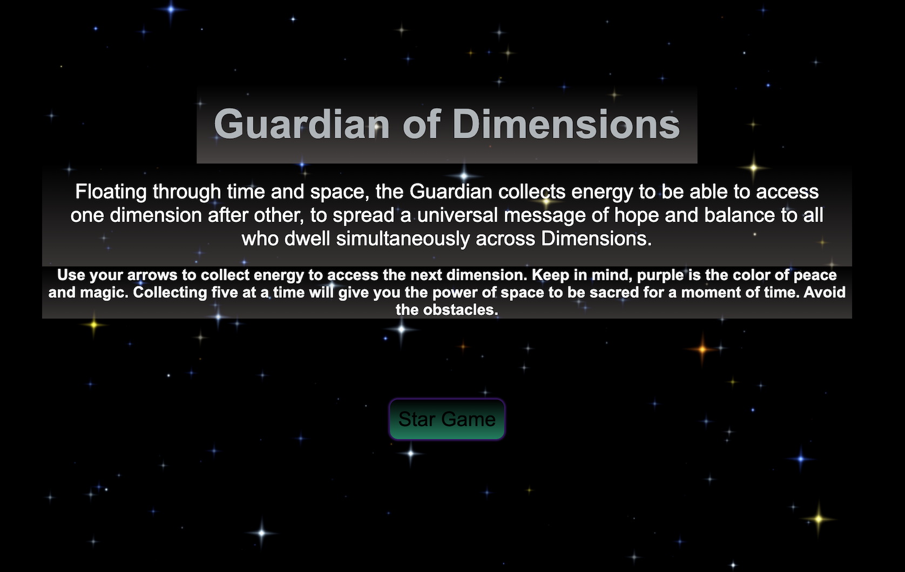

# Guardian-of-Dimensions-2D-Game

Floating through time and space, the Guardian collects energy to be able to access one dimension after other, to spread a universal message of hope and balance to all who dwell simultaneously across Dimensions.

This is my first 2-D Game I created using HTML5, Canvas, JS, Jquery & CSS3. I created all Sounddesign in that game.

Try it!

https://guardian-of-dimensions.netlify.app/

Project Documentation

Commands

To run and work with this project locally, you can use the following commands:

- git clone [repository URL] - Clone the project repository to your local machine.
- cd guardian-of-dimensions - Navigate to the project directory.
- open index.html - Open the game in a web browser.

How to Start

1. Clone or download the project repository to your local machine.
2. Navigate to the project directory using your terminal or command prompt.
3. Open the index.html file in a web browser to start the game.

Environment Variables

This project does not require specific environment variables.

General Instructions

- Objective: Your mission as the Guardian is to collect energy and access different dimensions, spreading a message of hope and balance.
- Controls: Use the arrow keys to navigate the Guardian through the dimensions.
- Gameplay:
 - Start in a dimension with the Guardian character.
 - Collect energy to access other dimensions.
- Sound: Enjoy a unique sound design created exclusively for this game.
- Win Condition: Share the universal message of hope and balance by accessing all dimensions.

Feel free to explore, share, and have fun with "Guardian of Dimensions"! Your journey awaits.